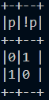
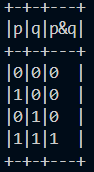
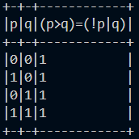

# CDMS

Computer Descreete Math Solver or CDMS is a crossplatform command line tool for doing operation on logic expressions.

## Usage

For help run:\
`./cdms` or `./cdms h`

For building a truth table run:\
`./cdms t <variables> <expression>`

## Truth table

\<variables\> - a string of consecutive non-repeating case-sencetive letters.

The truth table will be build for all possible variable values. So the amount of rows is two to the power of amount of variables.

Max of 8 variables at the same time are allowed.

Variables are case-sencetive and must not repeat.

\<expression\> - expression to calculate in a specific format.

Expression can include:
- Unary operations:
  - !a - not
- Binary operations:
  - a&b - and
  - a|b - or
  - a>b - if
  - a^b - xor
  - a=b - equal
- Sub expressions in parents:
  - (a)
- Variables that were declared previously:
  - r&q
- Constants:
  - 1
  - 0

Expressions cannot include:
- Spaces or other special characters
- Other symbols

When calculating operator precedence is followed.

## Examples

  
  
  

## License

The license for this project is in `LICENSE` file. It is a modified MIT license.

## Credits

Creator:
- [Stanislav Yatskiv | UAPROGRAMER](https://github.com/UAPROGRAMER)

## Contact info

GitHub: [UAPROGRAMER](https://github.com/UAPROGRAMER) \
Email: stasyatskiu2008@gmail.com